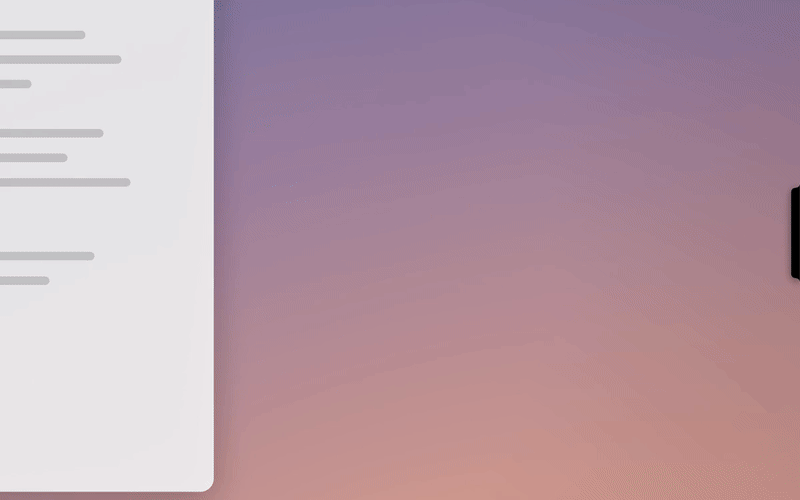
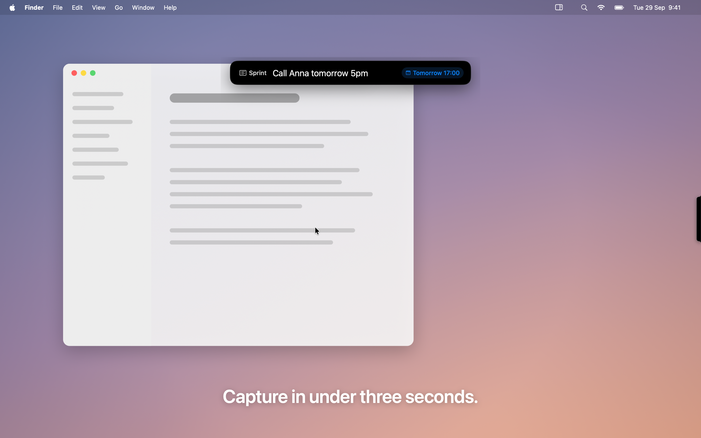

<p align="center"></p>

<h1 align="center">Brink</h1>
<p align="center"><b>Your pages, on the edge.</b><br>A quiet notch on the edge of your Mac's screen that keeps your Notion pages and tasks one hover away.</p>

<p align="center">
  <a href="https://github.com/StepanBlaha/Brink/releases/latest"></a>
  
  
  <a href="LICENSE"></a>
  <a href="https://github.com/StepanBlaha/Brink/releases"></a>
</p>

<p align="center"><a href="https://github.com/StepanBlaha/Brink/releases/latest"><b>⬇ Download Brink for Mac</b></a> · <a href="https://brinknotch.site/">Website</a> · <a href="https://brinknotch.site/#faq">FAQ</a></p>

<p align="center"></p>

> Brink is an independent app. It is not affiliated with, endorsed by, or sponsored by Notion Labs, Inc. "Notion" is a trademark of Notion Labs, Inc.

## What it does

- **The notch.** A black pill rests on the edge of your screen: left, right, or top next to the hardware notch. Hover it and it unfolds into a strip of your pinned pages. Click an icon and it expands into a panel.
- **A Notion-style editor.** Type Markdown and it turns into real blocks as you go: to-dos you can tick, headings, lists, quotes, toggles, callouts, code and dividers. There's also a slash menu, ⌘F, drag-to-reorder and pasted images.
- **Tasks.** Pin a database with saved filters and sorts. Snooze tasks, set dates, and see badges and a live progress pill.
- **Capture from anywhere.** ⌥⇧Space opens quick capture, which understands dates in English and Czech ("friday 5pm", "zítra"). ⌥⌘V appends the clipboard, and "Send to Brink" works from any Share menu.
- **Glance without opening.** Hover a pin to see its next items and tick them in place. There's also a menu-bar list and a desktop widget with checkboxes.
- **Make it yours.** Choose the edge, display, pill style, size, accent color, hotkeys, groups, pin icons and sounds.
- **Private.** Brink only talks to Notion. There's no account, no analytics and no tracking.

<p align="center">
  
  
</p>

## Install

**You need:** macOS 14 Sonoma or later, and a Notion account.

1. Download **Brink-x.y.z.zip** from [Releases](https://github.com/StepanBlaha/Brink/releases/latest), unzip it and move **Brink.app** to Applications. Or use Homebrew: `brew install --cask stepanblaha/tap/brink`. Newer Homebrew asks you to trust the tap once first: `brew trust stepanblaha/tap`
2. The first time, **right-click Brink → Open → Open**. The app isn't notarized yet, so macOS asks once.
3. Follow the welcome steps:
   1. Create an **internal integration** at [notion.so/profile/integrations](https://www.notion.so/profile/integrations) and paste its token into Brink.
   2. In Notion, share each page you want with the integration: page `•••` → **Connections**.
   3. Pin your first page from the notch.

**Optional:**
- **Widget:** right-click the desktop → **Edit Widgets** → **Brink Pins**.
- **Share menu:** if "Send to Brink" isn't listed, enable it in System Settings → General → Login Items & Extensions → **Sharing**.
- **Launch at login:** turn it on in Brink Settings → General.

Questions? See the [FAQ](https://brinknotch.site/#faq) or [open an issue](https://github.com/StepanBlaha/Brink/issues/new/choose).

## Privacy

Your Notion token stays in the macOS Keychain, and your pages are cached only on your Mac. Nothing is sent anywhere except the Notion API. Read the full [privacy policy](legal/PRIVACY.md) and [terms](legal/TERMS.md).

---

## For developers

### Build and run

The full app, with the widget and Share extension, needs Xcode 26+ and [XcodeGen](https://github.com/yonaskolb/XcodeGen) (`brew install xcodegen`):

```bash
./scripts/run-xcode.sh           # generate the project, build, launch
./scripts/run-xcode.sh --build-only
./scripts/release.sh             # Release build zipped into dist/
```

A quick SwiftPM build without the extensions, and the tests:

```bash
./scripts/run.sh
swift test
```

`project.yml` generates `Brink.xcodeproj`. Signing is Automatic and works with a free Apple ID team. The widget and Share extension share data through the App Group `<TEAM>.cz.stepanblaha.brink`.

### Project layout

| Path | What's there |
|---|---|
| `Sources/NotionKit/` | Notion API client (rate-limited, API version 2025-09-03), models, Keychain, stores, the editor sync engine (`Markdown/`), capture parsing, shared widget data |
| `Sources/NotionDock/` | The macOS app: notch windows, strip, panel, page editor, database view, settings, menu bar, hotkeys, quick capture, demo mode |
| `Sources/BrinkWidget/`, `Sources/BrinkShare/` | Widget and Share extensions |
| `Tests/NotionKitTests/` | 190+ tests, including a fake Notion server for end-to-end sync |
| `website/` | The landing page: Next.js static export with CSS Modules, Motion and Locomotive Scroll |
| `branding/` | Brand guide, app icon and share image, with the scripts that generate them |
| `marketing/` | Screenshots, GIFs, App Store listing and launch copy |
| `legal/`, `LICENSE` | Privacy policy, terms and third-party notices |

The code module and storage folders are still named `NotionDock`, the app's working name. They're kept so that existing installs keep their pins and settings.

### Demo recordings

`./scripts/record-demo.sh` launches Brink in **demo mode**. It uses a fake in-process Notion with sample pages and a temporary storage folder, so your pins, cache, token and preferences aren't touched. A wallpaper backdrop and a scripted cursor are drawn on top. The script records the screen and writes the screenshots, website videos and GIFs. It needs Screen Recording permission, and you shouldn't touch the mouse for about a minute while it runs. The code is in `Sources/NotionDock/Features/Demo/`.

### Website

```bash
cd website
npm install
npm run dev          # http://localhost:3000/
npm run build        # static export to website/out
npm run lint && npm run typecheck
```

Site settings (URL, email, links, price) live in `website/src/site.ts`. The site is live at https://brinknotch.site (a custom domain on GitHub Pages) and is served from the root. The deploy workflow sets `NEXT_PUBLIC_SITE_URL=https://brinknotch.site` and writes the `CNAME` file on every deploy. Every push to `main` deploys `website/out` to the `gh-pages` branch.

## Contributing and security

Bug reports and ideas are welcome in [Issues](https://github.com/StepanBlaha/Brink/issues/new/choose). Pull requests are welcome; see [CONTRIBUTING.md](CONTRIBUTING.md). Please report security problems privately, as described in [SECURITY.md](SECURITY.md).

## License

Open source under the [MIT License](LICENSE), © 2026 Stepan Blaha. The name "Brink" and the app icon aren't covered by the license; see [TRADEMARKS.md](TRADEMARKS.md). Third-party notices are in [legal/NOTICE.md](legal/NOTICE.md). The design was inspired by [Codenotch](https://github.com/vinzdg/codenotch); no code from it is included.
