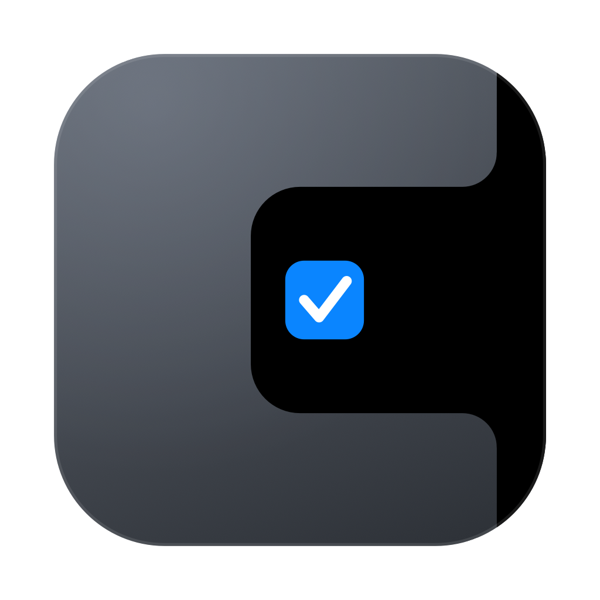
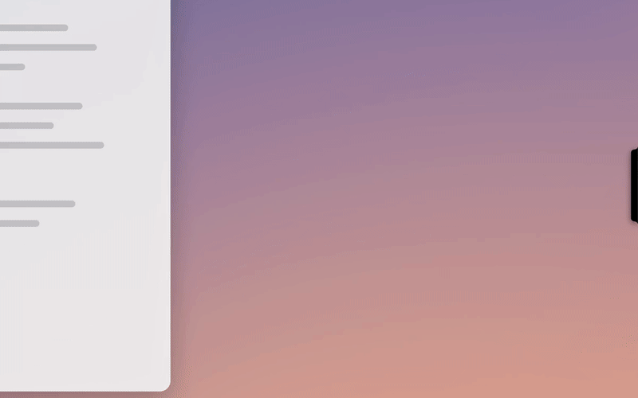
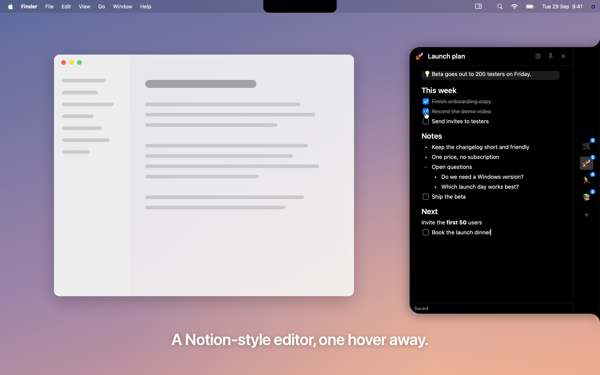

<p align="center"></p>

<h1 align="center">Brink</h1>
<p align="center"><b>Your pages, on the edge.</b><br>A quiet notch on the edge of your Mac's screen that keeps your Notion pages and tasks one hover away.</p>

<p align="center"></p>

> Brink is an independent app. It is not affiliated with, endorsed by, or sponsored by Notion Labs, Inc. "Notion" is a trademark of Notion Labs, Inc.

## What it does

- **The notch.** A black pill rests on a screen edge (left, right or top, next to the hardware notch). Hover it and it unfolds into a strip of your pinned pages; click an icon and it expands into a panel. It's one morphing shape with a liquid spring.
- **A Notion-style editor.** Type Markdown and it turns straight into real blocks: to-dos you can tick, headings, lists, quotes, toggles, callouts, code and dividers. It also has a slash menu, ⌘F, drag-to-reorder lines, pasted images and a cover strip.
- **Tasks.** Database pins can use saved filters and sorts. Snooze a task, pick dates, and see badges plus a live progress pill.
- **Capture from anywhere.** ⌥⇧Space opens quick capture, which understands dates in English and Czech ("zítra", "friday 5pm"). ⌥⌘V appends the clipboard, and "Send to Brink" works from the Share menu.
- **Glance without opening.** Hover a pin to see its next items and tick them in place. There's also a menu-bar mini-list and a desktop widget with interactive checkboxes.
- **Make it yours.** Choose the edge and display, the pill style, size, accent color, a per-pin panel size, sounds, rebindable hotkeys, groups and custom pin icons.

## Screenshots



More in [`marketing/screenshots/`](marketing/screenshots/) and [`website/assets/media/`](website/assets/media/) (editor and quick-capture clips). All media are recorded in demo mode with sample data: `./scripts/record-demo.sh` (see [Demo recordings](#demo-recordings)).

## Requirements

- macOS 14 Sonoma or later.
- A Notion **internal integration** token (create one at notion.so/profile/integrations). Share each page you want to pin with it: page `•••` → Connections.

## Build and run

The full app, including the widget and Share extension, needs Xcode 26+ and XcodeGen:

```bash
./scripts/run-xcode.sh
```

For a quick SwiftPM build without the extensions, and for tests:

```bash
./scripts/run.sh
swift test
```

### Demo recordings

`./scripts/record-demo.sh` builds the app, writes the trigger file `~/Library/Application Support/NotionDock/demo-mode.json` and launches Brink in demo mode: a fake in-process Notion with sample pages, a temporary storage folder (your pins, cache, Keychain token and preferences are left alone), a wallpaper backdrop and a scripted fake cursor. It records the screen and writes the App Store screenshots and website videos (`scripts/make-demo-media.sh`). It needs Screen Recording permission for your terminal; don't touch the mouse while it runs (about a minute). Code: `Sources/NotionDock/Features/Demo/`.

`project.yml` generates `Brink.xcodeproj`. Signing is Automatic and works with a free Apple ID team. The app group is `<TEAM>.cz.stepanblaha.brink`.

## Project layout

| Path | What's there |
|---|---|
| `Sources/NotionKit/` | Notion API client (rate-limited, 2025-09-03 data sources), models, Keychain, stores, the editor engine (`Markdown/`), capture parsing, shared widget data |
| `Sources/NotionDock/` | The macOS app: notch windows, strip, panel, page editor, database view, settings, menu bar, hotkeys, quick capture |
| `Sources/BrinkWidget/`, `Sources/BrinkShare/` | Widget and Share extensions |
| `Tests/NotionKitTests/` | 190+ tests, including a fake Notion server for end-to-end sync |
| `branding/` | Brand guide, app icon and its generator |
| `legal/`, `LICENSE` | Privacy policy, terms, third-party notices |
| `website/`, `marketing/` | Landing page, SEO, press kit, App Store and launch copy |

The code module is still named `NotionDock`. Existing installs keep their data because the bundle id and storage paths stayed the same. Rename it only before a first public release.

## Privacy

Brink talks only to the Notion API. Your token is kept in the Keychain, and your content is cached on your Mac. There's no analytics or tracking. See [legal/PRIVACY.md](legal/PRIVACY.md).

## License

Proprietary, © 2026 Stepan Blaha. All rights reserved. See [LICENSE](LICENSE) and [legal/NOTICE.md](legal/NOTICE.md). The design was inspired by [Codenotch](https://github.com/vinzdg/codenotch); no code from it is included.
