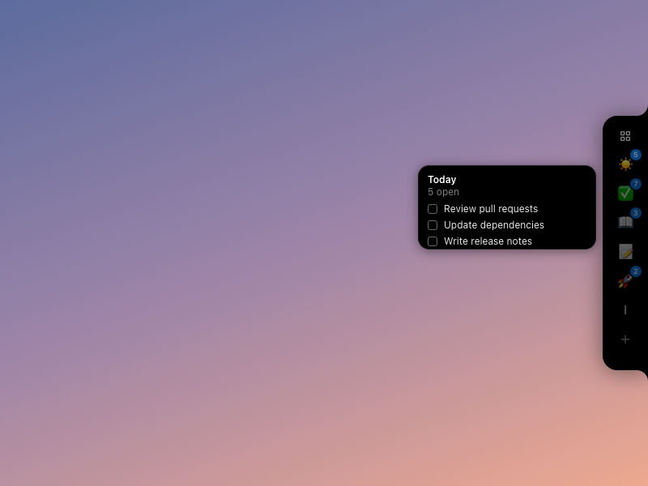
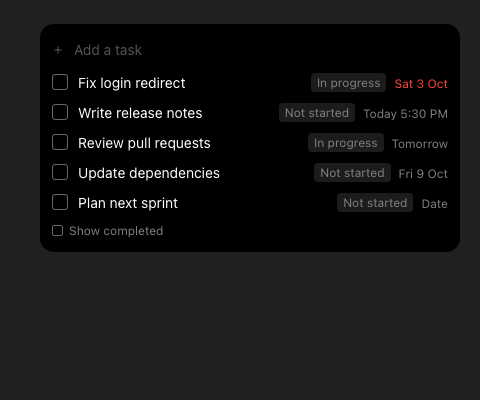
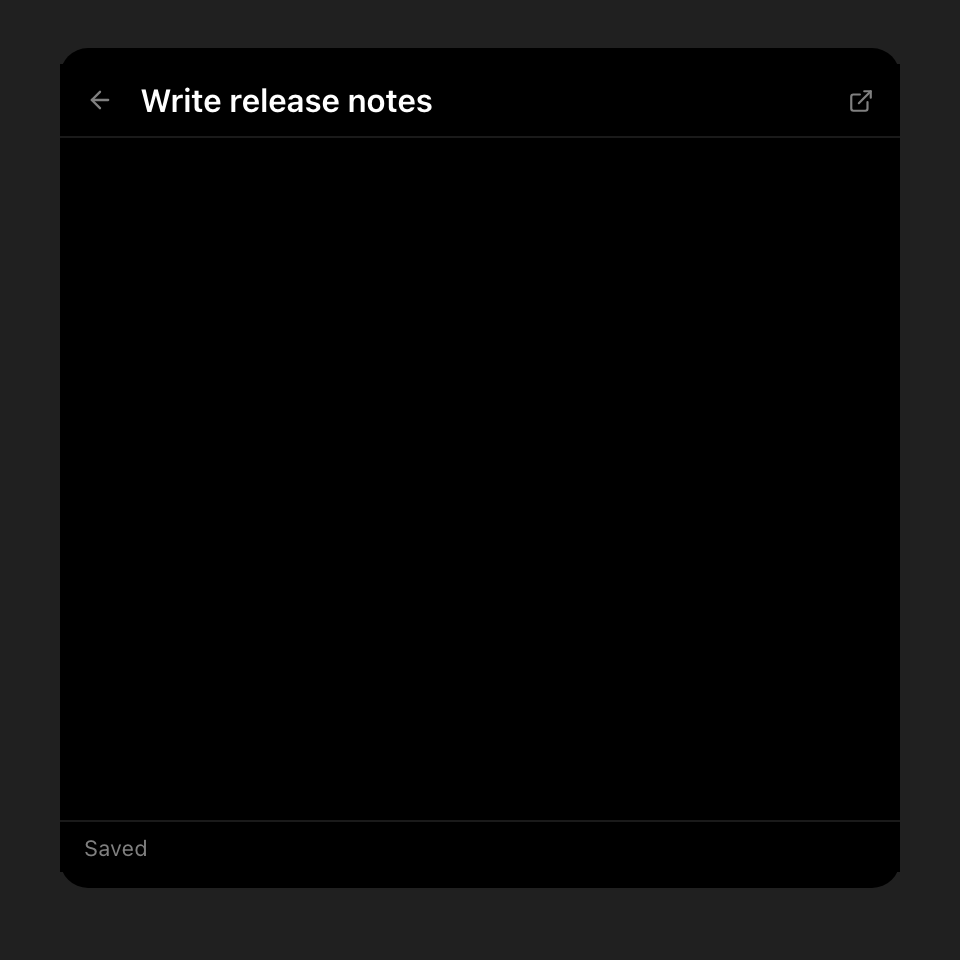
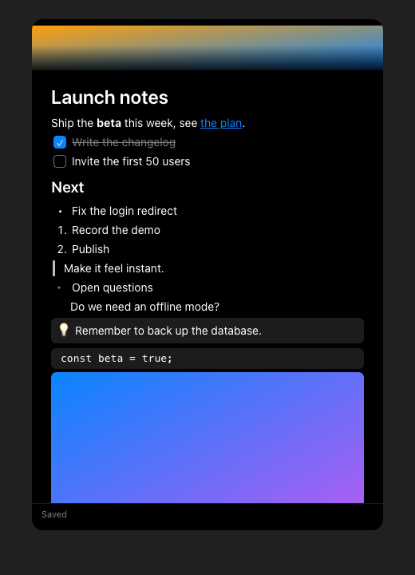
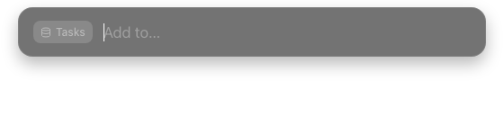
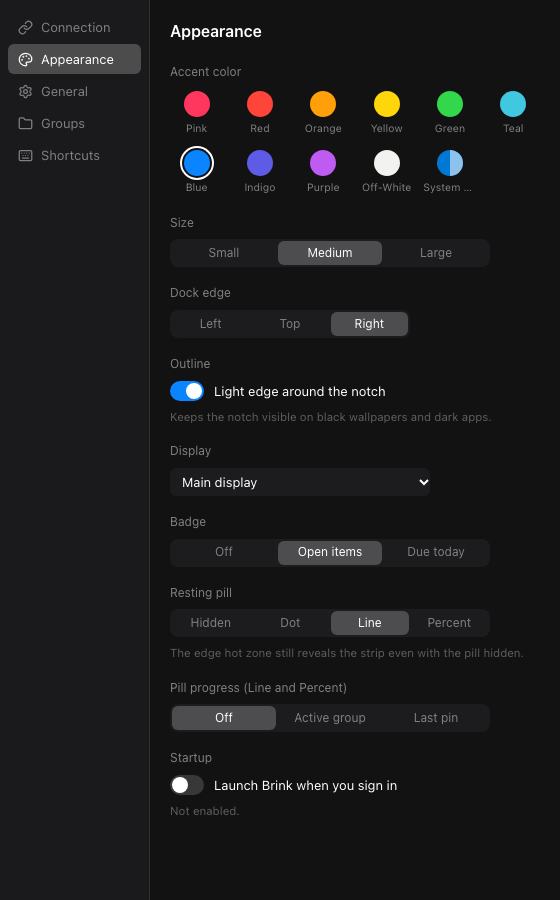
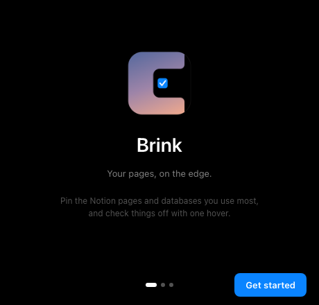

# Brink for Windows

Tauri 2 + React 19 + TypeScript + Vite port of Brink. Plan: `../docs/WINDOWS-PORT.md`. Decisions: `DECISIONS.md`.

## Features
- **Notch on your screen edge.** A black pill that morphs into a pin strip, a peek card and a full panel. Right, left or top edge, three sizes, accent presets and the Windows system accent.
- **Pins.** Pin any Notion page or database, reorder by dragging, group pins, custom emoji, symbol or letter icons, badges with open and due counts, a live progress pill.
- **Tasks.** Database pins become a task list: quick add with natural dates, checkboxes, date chips, status, snooze, saved filters and sorts. Open a task as a page with Back, Open in Notion and a right-click menu.
- **Today.** One list of everything due today or overdue across your databases.
- **Page editor.** Markdown shortcuts, slash menu, toggles, callouts, images, find, links, drag handle, embedded databases, saved to Notion with an offline queue.
- **Quick capture.** Global hotkeys, a capture window, clipboard append, tray flyout, `brink://` links.
- **Reminders.** Windows toasts with Mark done, Snooze and Open.
- **Accessible.** Keyboard use of strip, panel, editor and dialogs, visible focus rings, screen reader names for every state, High Contrast and reduced motion support, text scaling.
- **Demo mode.** `Brink.exe --demo` runs on a fake Notion with sample pins and never touches your token or data. See `scripts/record-demo.ps1`.

## Screenshots
Captured on the Vite pages in demo mode. See `docs/screens/` for every milestone.

| | |
|---|---|
|  Strip |  Peek |
|  Tasks |  Task opened as a page |
|  Editor |  Quick capture |
|  Settings |  Welcome |

## Prerequisites
Node 22+, Rust stable (`rustup`). On Windows also the MSVC build tools; WebView2 is preinstalled on Windows 11.

## Run in dev (macOS or Windows)
```
cd windows
npm ci
npm run tauri dev     # native window (Tauri); Rust + Vite hot reload
npm run dev:web       # browser only, IPC mocked (src/ipc/mock.ts), http://127.0.0.1:1420
```
Windows are routed by URL hash: `#/notch`, `#/capture`, `#/settings`, ...

## Build
```
npm run build               # typecheck + Vite bundle
npm run tauri build -- --bundles nsis   # Windows: unsigned per-user NSIS installer
```
Installer lands in `src-tauri/target/release/bundle/nsis/`.

## Test
```
npm run typecheck && npm run lint && npm test
cd src-tauri && cargo fmt --check && cargo clippy --all-targets -- -D warnings && cargo test
```
`npm run sync-version` copies the repo-root `VERSION` into `package.json` and `tauri.conf.json`.

## CI
`.github/workflows/windows.yml` runs all of the above on `windows-latest` and uploads the NSIS installer as an artifact.
